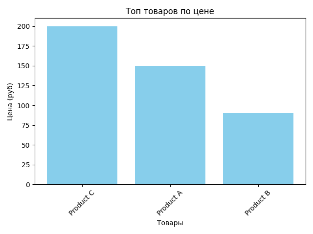

# Обработка Excel на Python

Скрипт для автоматической сортировки данных в Excel и построения графиков.

## 🔹 Функционал
- Загрузка данных из Excel-файла
- Сортировка товаров по цене (от высокой к низкой)
- Сохранение результатов в новый файл
- Построение графиков (используется `openpyxl` и `matplotlib`)

## 🛠 Установка
1. Убедись, что у тебя установлен Python 3.8+
2. Установи зависимости:
   pip install openpyxl matplotlib

## 🚀 Использование
1. Помести свои данные в файл `data.xlsx` (шаблон ниже)
2. Запусти скрипт:
   python excel_processor.py
3. Результаты появятся в:
   - `sorted_data.xlsx` (отсортированные данные + график)
   - `plot.png` (изображение графика)

## 📂 Структура файлов
excel-automation/
├── excel_processor.py  # Основной скрипт
├── data.xlsx           # Пример входных данных
├── sorted_data.xlsx    # Результат после работы
└── plot.png            # График из matplotlib
